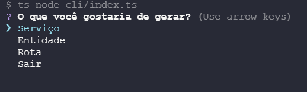

# API Base com Clean Architecture

Uma API REST robusta construída com princípios de Clean Architecture, TypeScript e práticas modernas de desenvolvimento.

## 🏗️ Arquitetura

O projeto segue os princípios da Clean Architecture, promovendo uma separação clara entre domínios e responsabilidades:

### Principais Camadas

- **Entidades**: Core da aplicação contendo regras de negócio (ex: User)
- **Use Cases**: Implementa os casos de uso orquestrando entidades e serviços (ex: LoginUserUseCase)
- **Controladores**: Gerencia requisições HTTP (ex: UserController)
- **Serviços**: Implementações externas como hash, tokens etc (ex: BcryptService)
- **Repositórios**: Abstrai persistência de dados (ex: UserRepositoryPrisma)

Com base no código fonte, vou explicar como o projeto implementa os princípios SOLID e Clean Architecture:

### Princípios SOLID

1. **Single Responsibility (SRP)**

   - Cada classe deve ter uma única responsabilidade ou razão para mudar. Isso significa que uma classe deve ser responsável por apenas uma parte da funcionalidade fornecida pelo software, facilitando a manutenção e evolução do código.
   - Exemplos:
     - `User` - Entidade de domínio
     - `UserController` - Controlador HTTP
     - `BcryptService` - Serviço de criptografia
     - `JwtTokenService` - Serviço de tokens

2. **Open/Closed (OCP)**

   - As classes devem estar abertas para extensão, mas fechadas para modificação. Isso significa que o comportamento de uma classe pode ser estendido sem alterar seu código fonte, geralmente através de interfaces e herança.
   - Exemplos:
     - `ITokenService`
     - `ICryptoService`
     - `IHttpServer`

3. **Liskov Substitution (LSP)**

   - Objetos de uma classe base devem poder ser substituídos por objetos de uma classe derivada sem afetar a funcionalidade do programa. Isso garante que a substituição de uma classe por outra não introduza erros.
   - Exemplos:
     - `FastifyHttpServer`
     - `ExpressHttpServer`

4. **Interface Segregation (ISP)**

   - Muitas interfaces específicas são melhores do que uma interface geral. Isso significa que os clientes não devem ser forçados a depender de interfaces que não utilizam, promovendo interfaces mais coesas e específicas.
   - Exemplos:
     - `IUseCase`
     - `IUserRepository`

5. **Dependency Inversion (DIP)**

   - Módulos de alto nível não devem depender de módulos de baixo nível, mas ambos devem depender de abstrações. Isso promove a inversão de dependências, onde detalhes dependem de abstrações e não o contrário.
   - Exemplos:
     - `UserController` depende de `IUseCase`
     - `LoginUserUseCase` depende de `IUserRepository`, `ICryptoService` e `ITokenService`

### Clean Architecture

1. **Camadas Independentes**

   - Entidades: `User`, `Email`
   - Use Cases: `LoginUserUseCase`
   - Controladores: `UserController`
   - Infraestrutura: `UserRepositoryPrisma`

2. **Dependência para o Centro**

   - Entidades não dependem de nada externo
   - Use Cases dependem apenas de entidades
   - Controladores dependem de Use Cases
   - Adaptadores externos (Prisma, Express) na camada mais externa

3. **Inversão de Dependência**

   - Interfaces definem contratos
   - Implementações concretas dependem de abstrações

## 🛠️ CLI Embutido

O projeto inclui um CLI (Command Line Interface) para facilitar a geração de novos serviços, entidades e rotas. Este CLI ajuda a manter a consistência do código e acelera o desenvolvimento.

### Vantagens de Usar o CLI

- **Consistência**: Garante que todos os arquivos gerados sigam o mesmo padrão.
- **Produtividade**: Reduz o tempo necessário para criar novos componentes.
- **Facilidade de Uso**: Interface interativa que guia o desenvolvedor durante o processo de geração.

## Como usar

Após a instalação do projeto execute o comando

```sh
# com NPM
npm run cli
# com Yarn
yarn cli
```

Siga as instruções na tela ( use as setas do teclado)



## 🚀 Instalação das dependências

```sh
# com NPM
npm install
# com Yarn
yarn
```

## 🐳 Construindo e Executando com Docker

Para construir e executar o projeto utilizando Docker, siga os passos abaixo:

### Passo 1: Construir a Imagem Docker

```sh
docker compose build
```

### Passo 2: Executar os Containers

```sh
docker compose up
```

## 🗄️ Configuração do Prisma

Prisma é utilizado como ORM (Object-Relational Mapping) para interagir com o banco de dados de forma eficiente e tipada.

### Passo 1: Instalar as Dependências do Prisma

```sh
# com NPM
npm install @prisma/client
npm install prisma --save-dev

# com Yarn
yarn add @prisma/client
yarn add prisma --dev
```

### Passo 2: Inicializar o Prisma

```sh
npx prisma init
```

### Passo 3: Configurar o `schema.prisma`

Edite o arquivo `prisma/schema.prisma` para definir seu modelo de dados.

### Passo 4: Executar Migrações

```sh
npx prisma migrate dev
```

### Passo 5: Gerar o Cliente Prisma

```sh
npx prisma generate
```

### Passo 6:

```sh
npx prisma studio
```

### Visualizar Banco de Dados

Acesse http://localhost:5555/

### Pré-requisitos

- Node.js 21.5.0
- Docker e Docker Compose

## 🐳 Ambiente Docker

O projeto utiliza containers Docker para:

- PostgreSQL (porta 5432)
- Redis (porta 6379)

## 🛠️ Adicionando Novos Recursos

### Novo Serviço

1. Crie a interface em `src/services/novoServico/INovoServico.ts`
2. Implemente o serviço em `src/services/novoServico/NovoServico.ts`

### Nova Rota

1. Crie o controlador em `src/controllers/NovoController.ts`
2. Registre a rota em `src/routes/novasRotas.ts`

## 💡 Qualidade de Código

- **Husky + ESLint + Prettier + Jest**
  - O projeto utiliza hooks do Git para garantir qualidade:
  - Pre-commit: Executa ESLint e Prettier
  - Commit-msg: Valida mensagem com Commitizen
  - Pre-push: Executa testes Jest

### Benefícios:

- Código padronizado e limpo
- Commits semânticos e organizados
- Testes garantem funcionamento
- Integração contínua facilitada

## 📝 Licença

Este projeto está sob a licença MIT.

Desenvolvido por Daniel Melo Alencar
